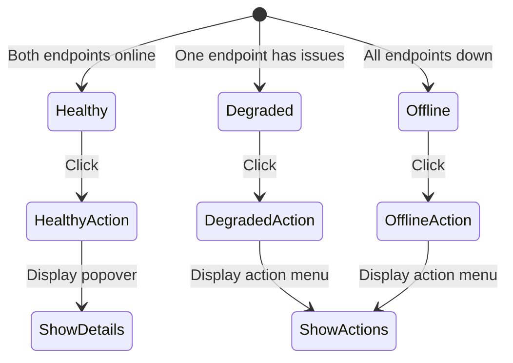

# Ollama Status Badge → Interactive Button

## Overview

Transform the Ollama status badge from a passive status indicator into an interactive button that allows users to take action when endpoints are offline or degraded.

## Current State

- **Component:** [`components/dashboard/ollama-status-badge.tsx`](components/dashboard/ollama-status-badge.tsx)
- **APIs:**
  - [`/api/ai/health`](app/api/ai/health/route.ts) - Dual-endpoint health check
  - [`/api/ollama-status`](app/api/ollama-status/route.ts) - Legacy single-endpoint
- **Cross-monitor:** [`lib/ai/cross-monitor.ts`](lib/ai/cross-monitor.ts) - Has existing recovery logic

## Proposed Changes

### 1. Badge Button States & Actions



### 2. Full Options Menu (Always Available on Click)

When clicking the badge, a dropdown menu appears with these options:

#### Status Section (always shown at top)

```
┌─────────────────────────────────────┐
│ PC:  ● Online · 45ms · qwen3:30b    │
│ Pi:  ● Online · 120ms · qwen3:8b    │
├─────────────────────────────────────┤
│ 🔄 Refresh Status                   │
│ 📡 Ping All Endpoints               │
├─────────────────────────────────────┤
│ 🔌 Wake PC                    (if offline) │
│ 🔌 Wake Pi                    (if offline) │
│ 📦 Load Model on PC           (if model not loaded) │
│ 📦 Load Model on Pi           (if model not loaded) │
├─────────────────────────────────────┤
│ 📊 View Details                     │
│ 📜 View Logs                        │
│ ⚙️ AI Settings                      │
└─────────────────────────────────────┘
```

#### Menu Actions Reference

| Action                    | Always Visible?                          | Description                                        |
| ------------------------- | ---------------------------------------- | -------------------------------------------------- |
| **🔄 Refresh Status**     | Yes                                      | Force immediate health check on all endpoints      |
| **📡 Ping All Endpoints** | Yes                                      | Extended timeout deep health check                 |
| **🔌 Wake PC**            | Only when PC offline                     | Start Ollama service on PC via system command      |
| **🔌 Wake Pi**            | Only when Pi offline                     | SSH to Pi, restart Ollama service                  |
| **📦 Load Model on PC**   | Only when PC online but model not loaded | Preload configured model into memory               |
| **📦 Load Model on Pi**   | Only when Pi online but model not loaded | Preload model on Pi                                |
| **📊 View Details**       | Yes                                      | Open detailed health modal with full endpoint info |
| **📜 View Logs**          | Yes                                      | Link to AI health logs/cross-monitor recovery log  |
| **⚙️ AI Settings**        | Yes                                      | Navigate to AI settings page                       |

#### Visual State Indicators on Badge Itself

| State             | Badge Appearance                 |
| ----------------- | -------------------------------- |
| **All Healthy**   | Green badge with pulse animation |
| **Degraded**      | Amber badge with pulse animation |
| **Offline**       | Red badge, no pulse              |
| **Loading Model** | Blue badge with pulse animation  |

### 3. New API Endpoint: `/api/ai/wake`

Create a new API route to handle wake/ping actions:

```ts
// POST /api/ai/wake
// Request body: { endpoint: 'pc' | 'pi' | 'all' }
// Response: { success: boolean, message: string, results: EndpointResult[] }
```

**Actions:**

- **Ping:** Force immediate health check with extended timeout
- **PC Wake:** Attempt to start Ollama service via `Start-Service Ollama` (Windows) or `systemctl start ollama` (Linux)
- **Pi Wake:** SSH to Pi and run `systemctl restart ollama` (if SSH configured)
- **Model Load:** Trigger model preload via `/api/generate` with empty prompt

### 4. Component Changes

#### Badge Wrapper

- Wrap existing badge content in a `<button>` element
- Add `cursor-pointer` and hover states
- Add `aria-label` for accessibility
- Add loading spinner during actions

#### Popover/Menu Component

- Create a small popover that appears on click
- Show relevant actions based on current state
- Display action result feedback (success/error)

#### Action Handlers

- `handlePing()` - Force immediate health check
- `handleWake(endpoint)` - Call `/api/ai/wake` for specific endpoint
- `handleLoadModel(endpoint)` - Trigger model preload
- `handleRefresh()` - Force badge refresh

### 5. Implementation Files

| File                                           | Change Type        | Description                                  |
| ---------------------------------------------- | ------------------ | -------------------------------------------- |
| `components/dashboard/ollama-status-badge.tsx` | Modify             | Add button wrapper, popover, action handlers |
| `app/api/ai/wake/route.ts`                     | **New**            | API endpoint for wake/ping actions           |
| `lib/ai/ollama-wake.ts`                        | **New**            | Wake logic for PC and Pi endpoints           |
| `components/ui/action-popover.tsx`             | **New** (optional) | Reusable popover component                   |

### 6. Detailed Implementation Steps

#### Step 1: Create Wake API Endpoint

```
app/api/ai/wake/route.ts
```

- Accept POST with `{ endpoint: 'pc' | 'pi' | 'all' }`
- For PC: Execute system command to start Ollama service
- For Pi: SSH command (if configured) or just extended ping
- Return results with success/failure status

#### Step 2: Create Wake Utility Module

```
lib/ai/ollama-wake.ts
```

- `pingEndpoint(url, extendedTimeout)` - Deep health check
- `wakePcOllama()` - Start PC Ollama service
- `wakePiOllama()` - SSH to Pi to restart (if configured)
- `preloadModel(url, model)` - Load model into memory

#### Step 3: Update Badge Component

- Add `useState` for popover open state
- Add `useState` for action loading state
- Wrap badge in `<button>` with onClick handler
- Create popover component with contextual actions
- Add action handlers that call the wake API
- Show loading spinner during actions
- Display success/error feedback

#### Step 4: Add Visual Feedback

- Hover state: slight brightness change
- Active state: pressed appearance
- Loading state: spinner overlay
- Success: brief green flash
- Error: brief red flash with error message

### 7. Security Considerations

- Wake API should be admin-only (already badge is admin-only in nav)
- Rate limit wake attempts (prevent spam)
- Log all wake attempts for audit
- PC service start requires appropriate permissions
- Pi SSH requires pre-configured keys

### 8. Fallback Behavior

- If wake fails, show helpful error message
- If SSH not configured for Pi, show manual instructions
- If permission denied, show admin contact suggestion
- If endpoint partially responds, show partial status

## Questions for User

1. **Pi Wake Method:** Is SSH already configured for Pi access, or should we just do extended ping/retry?
2. **Permission Level:** Should wake actions be admin-only or available to all chefs?
3. **Additional Actions:** Any other actions you want in the menu?

## Implementation Checklist

- [ ] Create `/api/ai/wake` endpoint for wake/ping actions
- [ ] Create `lib/ai/ollama-wake.ts` utility module
- [ ] Update `components/dashboard/ollama-status-badge.tsx`:
  - [ ] Add button wrapper with hover/click states
  - [ ] Add dropdown menu component
  - [ ] Add status section showing PC/Pi state
  - [ ] Add context-aware action buttons
  - [ ] Add loading states and feedback
  - [ ] Add navigation links (View Details, Logs, Settings)
- [ ] Test all actions (refresh, ping, wake, load model)
- [ ] Add error handling and user feedback

## Additional Considerations

### User Feedback

- **Success toast:** "PC Ollama service started successfully"
- **Error toast:** "Failed to wake PC: Permission denied. Try running as administrator."
- **Loading state:** Show spinner on the action item while in progress
- **Auto-refresh:** After any action, automatically refresh status after 2-3 seconds

### Confirmation Dialogs

- **Wake actions:** Confirmation dialog before executing (e.g., "Wake PC Ollama?" Yes/Cancel)
- **Reason:** Wake is a system-level action, confirmation prevents accidental triggers

### Mobile Responsiveness

- Menu should be touch-friendly
- Consider bottom sheet on mobile instead of dropdown

### Keyboard Accessibility

- Enter/Space to open menu
- Arrow keys to navigate
- Escape to close

### Action History

- Show last action result in menu: "Last: Wake PC · 2 min ago · ✓"
- Useful for debugging and awareness

### Additional Menu Actions (Included)

| Action             | Description                     |
| ------------------ | ------------------------------- |
| **🌡️ Temperature** | Show GPU/CPU temp if available  |
| **💾 Memory**      | Show Ollama memory consumption  |
| **🔄 Restart**     | Full restart (not just wake)    |
| **📋 Copy Status** | Copy health report to clipboard |

---

## Visual Design Specification

### Badge States (Before Click)

```
┌─────────────────────────────────────────────────────────────────┐

HEALTHY STATE:                                                  │
┌──────────────────────┐                                        │
│ ● PC · 45ms | Pi · 120ms │  ← Green bg, emerald border        │
└──────────────────────┘                                        │
  (clickable, shows cursor pointer)                              │

DEGRADED STATE:                                                 │
┌──────────────────────────┐                                    │
│ ● PC · 45ms | Pi Loading │  ← Amber bg, amber border          │
└──────────────────────────┘                                    │

OFFLINE STATE:                                                  │
┌─────────────────────┐                                         │
│ ○ AI Offline        │  ← Red bg, red border, no pulse        │
└─────────────────────┘                                         │

LOADING MODEL STATE:                                            │
┌─────────────────────┐                                         │
│ ● Loading Model     │  ← Blue bg, blue border                │
└─────────────────────┘                                         │

└─────────────────────────────────────────────────────────────────┘
```

### Dropdown Menu (After Click - Healthy State)

```
┌─────────────────────────────────────────────────────────────────┐
│                                                                 │
│  ┌─────────────────────────────────────────────────────────┐   │
│  │  AI Endpoints                                    [X]    │   │
│  ├─────────────────────────────────────────────────────────┤   │
│  │                                                         │   │
│  │  PC (Local)                                             │   │
│  │  ● Online · 45ms · qwen3-coder:30b                     │   │
│  │  🌡️ GPU: 72°C  ·  💾 RAM: 18.2 GB                      │   │
│  │                                                         │   │
│  │  Pi (Remote)                                            │   │
│  │  ● Online · 120ms · qwen3:8b                           │   │
│  │  🌡️ CPU: 58°C  ·  💾 RAM: 6.1 GB                       │   │
│  │                                                         │   │
│  ├─────────────────────────────────────────────────────────┤   │
│  │  ACTIONS                                                │   │
│  │  ─────────────────────────────────────────────────────  │   │
│  │  🔄 Refresh Status                                      │   │
│  │  📡 Ping All Endpoints                                  │   │
│  │  📋 Copy Status to Clipboard                            │   │
│  │                                                         │   │
│  │  LAST ACTION                                            │   │
│  │  ─────────────────────────────────────────────────────  │   │
│  │  ✓ Wake PC · 2 min ago                                  │   │
│  │                                                         │   │
│  ├─────────────────────────────────────────────────────────┤   │
│  │  NAVIGATION                                             │   │
│  │  ─────────────────────────────────────────────────────  │   │
│  │  📊 View Details                                        │   │
│  │  📜 View Logs                                           │   │
│  │  ⚙️ AI Settings                                         │   │
│  └─────────────────────────────────────────────────────────┘   │
│                                                                 │
└─────────────────────────────────────────────────────────────────┘
```

### Dropdown Menu (After Click - Offline State)

```
┌─────────────────────────────────────────────────────────────────┐
│                                                                 │
│  ┌─────────────────────────────────────────────────────────┐   │
│  │  AI Endpoints                                    [X]    │   │
│  ├─────────────────────────────────────────────────────────┤   │
│  │                                                         │   │
│  │  PC (Local)                                             │   │
│  │  ○ Offline · Connection refused                         │   │
│  │                                                         │   │
│  │  Pi (Remote)                                            │   │
│  │  ○ Offline · Host unreachable                          │   │
│  │                                                         │   │
│  ├─────────────────────────────────────────────────────────┤   │
│  │  RECOVERY ACTIONS                                       │   │
│  │  ─────────────────────────────────────────────────────  │   │
│  │  🔌 Wake PC                          [▶]                │   │
│  │  🔌 Wake Pi                          [▶]                │   │
│  │  📡 Ping All Endpoints                                  │   │
│  │  🔄 Refresh Status                                      │   │
│  │                                                         │   │
│  ├─────────────────────────────────────────────────────────┤   │
│  │  OTHER ACTIONS                                          │   │
│  │  ─────────────────────────────────────────────────────  │   │
│  │  📋 Copy Status to Clipboard                            │   │
│  │  📊 View Details                                        │   │
│  │  📜 View Logs                                           │   │
│  │  ⚙️ AI Settings                                         │   │
│  └─────────────────────────────────────────────────────────┘   │
│                                                                 │
└─────────────────────────────────────────────────────────────────┘
```

### Confirmation Dialog (Before Wake Action)

```
┌─────────────────────────────────────────────────────────────────┐
│                                                                 │
│        ┌───────────────────────────────────────────┐           │
│        │                                           │           │
│        │   🔌 Wake PC Ollama?                      │           │
│        │                                           │           │
│        │   This will start the Ollama service      │           │
│        │   on your local machine.                  │           │
│        │                                           │           │
│        │   ┌─────────────┐  ┌─────────────┐       │           │
│        │   │   Cancel    │  │   Wake PC   │       │           │
│        │   └─────────────┘  └─────────────┘       │           │
│        │                                           │           │
│        └───────────────────────────────────────────┘           │
│                                                                 │
└─────────────────────────────────────────────────────────────────┘
```

### Toast Notifications

```
SUCCESS TOAST:
┌─────────────────────────────────────────────────────────────────┐
│ ✓ PC Ollama service started successfully              [X]       │
└─────────────────────────────────────────────────────────────────┘

ERROR TOAST:
┌─────────────────────────────────────────────────────────────────┐
│ ✕ Failed to wake PC: Permission denied                [X]       │
│   Try running as administrator.                                 │
└─────────────────────────────────────────────────────────────────┘

LOADING STATE (in menu):
┌─────────────────────────────────────────────────────────────────┐
│ ⏳ Waking PC...                                    [spinner]    │
└─────────────────────────────────────────────────────────────────┘
```

### Hover States

```
NORMAL:                          HOVER:
┌─────────────────────┐         ┌─────────────────────┐
│ ● PC · 45ms | Pi    │         │ ● PC · 45ms | Pi    │  ← Slightly
└─────────────────────┘         └─────────────────────┘    brighter bg
    cursor: default                  cursor: pointer

MENU ITEM NORMAL:                MENU ITEM HOVER:
┌─────────────────────────┐     ┌─────────────────────────┐
│ 🔄 Refresh Status       │     │ 🔄 Refresh Status       │ ← Highlighted
└─────────────────────────┘     └─────────────────────────┘   background
```
