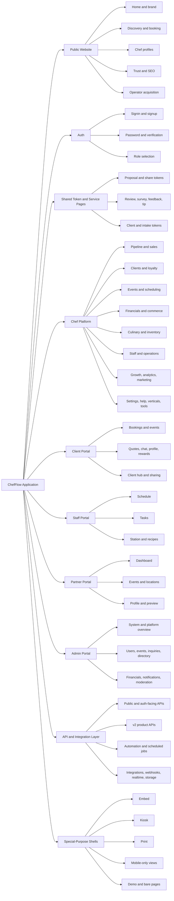
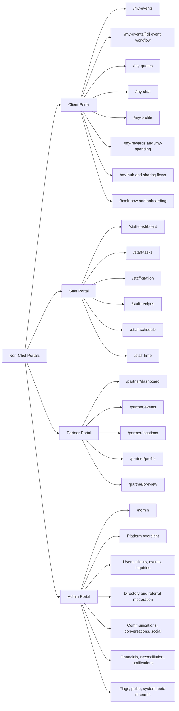
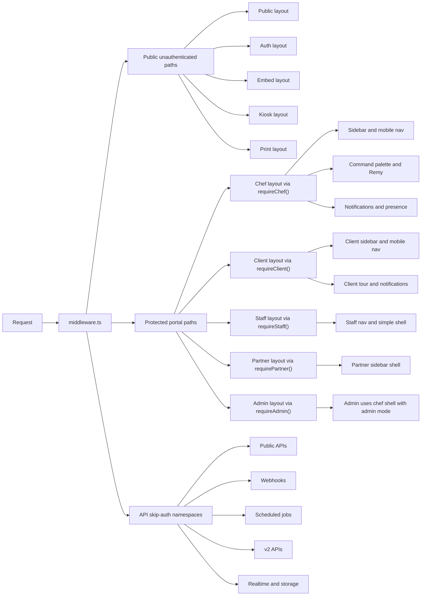

# ChefFlow Complete System Schematic Pack

Updated: 2026-04-09

This is the printable, whole-system schematic pack for ChefFlow.

It is based on the live repo structure in `app/`, plus the existing inventory documents:

- [docs/feature-route-map.md](/c:/Users/david/Documents/CFv1/docs/feature-route-map.md)
- [docs/app-complete-audit.md](/c:/Users/david/Documents/CFv1/docs/app-complete-audit.md)
- [docs/chef-portal-complete-index.md](/c:/Users/david/Documents/CFv1/docs/chef-portal-complete-index.md)

## Snapshot

- `app/` currently contains `699` `page.tsx` routes.
- `app/api/` currently contains `316` `route.ts` handlers.
- `app/` currently contains `16` `layout.tsx` shells.
- The largest surface is the chef platform under `app/(chef)`.
- The highest-density API namespace is `app/api/v2`.

## Print Guidance

- Print each Mermaid diagram on its own page.
- Use landscape orientation for Sheets 1, 3, 4, 5, and 6.
- Use portrait or landscape for Sheet 2 depending on how large you want the public surface map.
- These sheets are route-family schematics, not every individual leaf route.

## Surface Inventory

| Surface                    | Current Shape                                                                     | What It Represents                                                             |
| -------------------------- | --------------------------------------------------------------------------------- | ------------------------------------------------------------------------------ |
| Public website             | `app/(public)` plus top-level public utilities                                    | Marketing, discovery, trust, SEO, chef profiles, booking entry                 |
| Chef platform              | `app/(chef)`                                                                      | Main operating system for chefs and internal operators                         |
| Client portal              | `app/(client)`                                                                    | Client self-service workspace                                                  |
| Staff portal               | `app/(staff)`                                                                     | Staff-facing execution workspace                                               |
| Partner portal             | `app/(partner)`                                                                   | Referral partner workspace                                                     |
| Admin portal               | `app/(admin)`                                                                     | Internal control surface                                                       |
| Auth                       | `app/auth`                                                                        | Sign in, sign up, password, role selection                                     |
| Shared token/service pages | mixed public and top-level routes                                                 | Proposal, share, view, review, feedback, intake, tokenized access              |
| Special-purpose shells     | `app/embed`, `app/kiosk`, `app/print`, `app/(mobile)`, `app/(demo)`, `app/(bare)` | Embedded booking, kiosk mode, print pages, mobile-only views, demo, bare pages |
| API layer                  | `app/api`                                                                         | Public APIs, internal APIs, v2 APIs, jobs, integrations, webhooks              |

## Sheet 1. Complete System Surface Overview

## Sheet 2. Public Website and Shared Public-Facing Surfaces

```mermaid
flowchart TB
  A["Public Surface"]

  A --> B["Canonical Consumer Path"]
  A --> C["Supporting Discovery"]
  A --> D["Trust and Company"]
  A --> E["Operator Acquisition"]
  A --> F["Shared Public Tokens"]
  A --> G["Special Public Utilities"]

  B --> B1["/"]
  B --> B2["/book"]
  B --> B3["/chefs"]
  B --> B4["/chef/[slug]"]
  B --> B5["/chef/[slug]/inquire"]

  C --> C1["/nearby"]
  C --> C2["/nearby/[slug]"]
  C --> C3["/services"]
  C --> C4["/discover and discover/* legacy"]

  D --> D1["/about"]
  D --> D2["/how-it-works"]
  D --> D3["/faq"]
  D --> D4["/contact"]
  D --> D5["/trust"]
  D --> D6["/privacy, /terms, /unsubscribe"]
  D --> D7["/compare/* and /customers/*"]

  E --> E1["/for-operators"]
  E --> E2["/marketplace-chefs"]
  E --> E3["/partner-signup"]

  F --> F1["/proposal/[token]"]
  F --> F2["/share/[token]"]
  F --> F3["/view/[token]"]
  F --> F4["/review/[token]"]
  F --> F5["/survey/[token]"]
  F --> F6["/feedback/[token]"]
  F --> F7["/tip/[token]"]
  F --> F8["/availability/[token]"]
  F --> F9["/client/[token] and /intake/[token]"]

  G --> G1["/book/[chefSlug] and campaign booking"]
  G --> G2["/embed/inquiry/[chefId]"]
  G --> G3["/kiosk/*"]
  G --> G4["/print/menu/[id]"]
  G --> G5["/beta and /beta-survey"]
  G --> G6["/staff-login and /staff-portal"]
```

## Sheet 3. Chef Platform Map

```mermaid
flowchart LR
  A["Chef Platform"]

  A --> B["Pipeline and Sales"]
  A --> C["Clients and Relationships"]
  A --> D["Events and Scheduling"]
  A --> E["Financials and Commerce"]
  A --> F["Culinary and Inventory"]
  A --> G["Operations and Team"]
  A --> H["Growth, Analytics, Community"]
  A --> I["Settings, Help, Verticals, Tools"]

  B --> B1["Inquiries"]
  B --> B2["Quotes"]
  B --> B3["Leads"]
  B --> B4["Calls"]
  B --> B5["Proposals"]
  B --> B6["Contracts"]
  B --> B7["Consulting"]
  B --> B8["Testimonials"]
  B --> B9["Marketplace and prospecting"]

  C --> C1["Clients"]
  C --> C2["Client history"]
  C --> C3["Preferences and dietary"]
  C --> C4["Communication and follow-up"]
  C --> C5["Guests and guest leads"]
  C --> C6["Partners and referrals"]
  C --> C7["Loyalty and rewards"]
  C --> C8["Circles and relationship hub"]

  D --> D1["Dashboard and queue"]
  D --> D2["Calendar and schedule"]
  D --> D3["Events"]
  D --> D4["Waitlist and scheduling"]
  D --> D5["Briefing and daily ops"]
  D --> D6["Reviews, AAR, feedback"]
  D --> D7["Travel"]

  E --> E1["Financial hub"]
  E --> E2["Expenses"]
  E --> E3["Invoices"]
  E --> E4["Payments and payouts"]
  E --> E5["Ledger and tax"]
  E --> E6["Goals and reporting"]
  E --> E7["Commerce hub"]
  E --> E8["Products, promotions, register, settlements"]

  F --> F1["Culinary hub"]
  F --> F2["Menus"]
  F --> F3["Recipes"]
  F --> F4["Ingredients"]
  F --> F5["Components"]
  F --> F6["Costing"]
  F --> F7["Prep"]
  F --> F8["Inventory"]
  F --> F9["Vendors and pricing"]

  G --> G1["Staff"]
  G --> G2["Tasks"]
  G --> G3["Stations"]
  G --> G4["Production and kitchen"]
  G --> G5["Documents"]
  G --> G6["Notifications"]
  G --> G7["Operations and safety"]

  H --> H1["Analytics"]
  H --> H2["Marketing"]
  H --> H3["Growth"]
  H --> H4["Social"]
  H --> H5["Network and community"]
  H --> H6["Reputation"]
  H --> H7["Content"]

  I --> I1["Settings"]
  I --> I2["Help"]
  I --> I3["Onboarding and import"]
  I --> I4["Remy"]
  I --> I5["Cannabis vertical"]
  I --> I6["Dev and command tools"]
  I --> I7["Charity and specialty programs"]
```

## Sheet 4. Other Portals and Internal Control Surfaces

## Sheet 5. API, Automation, and Integration Layer

```mermaid
flowchart TB
  A["API and Service Layer"]

  A --> B["Public and Session APIs"]
  A --> C["Product APIs"]
  A --> D["Automation and Monitoring"]
  A --> E["Integrations and Webhooks"]
  A --> F["Support Services"]

  B --> B1["/api/book"]
  B --> B2["/api/auth"]
  B --> B3["/api/public"]
  B --> B4["/api/embed"]
  B --> B5["/api/demo and /api/kiosk"]

  C --> C1["/api/v2"]
  C --> C2["Booking, inquiries, quotes, events"]
  C --> C3["Clients, loyalty, partners, staff"]
  C --> C4["Commerce, invoices, payments, ledger"]
  C --> C5["Recipes, menus, taxonomy, search"]
  C --> C6["Settings, notifications, safety, remy"]

  D --> D1["/api/cron"]
  D --> D2["/api/scheduled"]
  D --> D3["/api/inngest"]
  D --> D4["/api/health and /api/monitoring"]
  D --> D5["/api/sentinel and /api/openclaw"]
  D --> D6["/api/build-version"]

  E --> E1["/api/webhooks"]
  E --> E2["/api/stripe"]
  E --> E3["/api/integrations"]
  E --> E4["/api/gmail"]
  E --> E5["/api/push"]
  E --> E6["/api/social"]

  F --> F1["/api/storage"]
  F --> F2["/api/realtime"]
  F --> F3["/api/documents"]
  F --> F4["/api/reports"]
  F --> F5["/api/notifications"]
  F --> F6["/api/feeds"]
```

## Sheet 6. Layout Shell and Access Boundary Map

## Notes

- The chef platform is too large to fit on one detailed page if you include every leaf route. That is why Sheet 3 is organized by route family rather than by every page.
- The public site and the tokenized pages are intentionally shown together because they share the most important unauthenticated entry points.
- The API sheet is organized by operational function, not by every endpoint, because `/api/v2` alone contains `149` route handlers.
- The access-boundary sheet matters because the repo is not a flat site. It is a set of role-bound shells, public shells, and special-purpose layouts that all behave differently.
