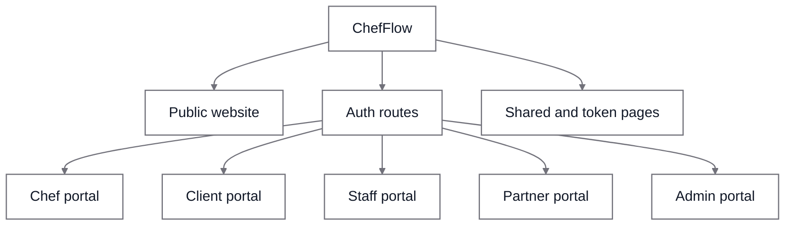
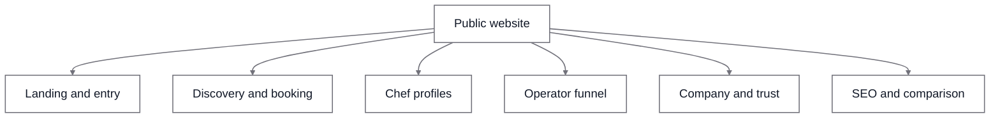
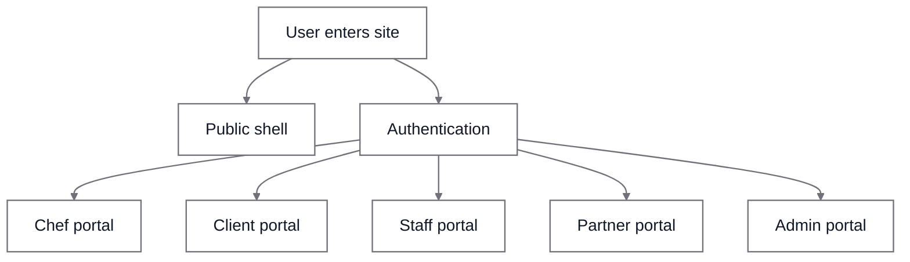
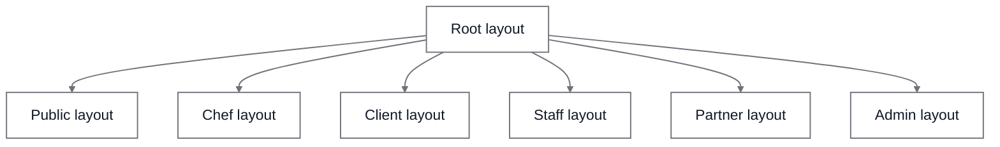

# ChefFlow Website Schematic

This is a high-level schematic of the current website and app surfaces in [`app/`](/c:/Users/david/Documents/CFv1/app). It is intended as a visualization layer over the full route inventory in [`docs/feature-route-map.md`](/c:/Users/david/Documents/CFv1/docs/feature-route-map.md).

The previous version tried to pack route detail directly into Mermaid nodes. That made the diagram unreadable once it rendered at page width. The diagrams below stay at the surface-map level, and the detailed route families are listed in plain text right under each one.

## 1. System Surface Overview

- Public website: `/`, `/nearby`, `/chefs`, `/services`, `/chef/[slug]`, `/compare`, `/customers`, `/about`, `/how-it-works`, `/faq`, `/contact`, `/trust`
- Auth routes: `/auth/signin`, `/auth/signup`, `/auth/forgot-password`, `/auth/reset-password`
- Shared and token pages: `/book`, `/proposal/[token]`, `/share/[token]`, `/view/[token]`, `/review/[token]`, `/survey/[token]`, `/feedback/[token]`, `/tip/[token]`, `/worksheet/[token]`
- Chef portal: `/dashboard`, `/inbox`, `/events`, `/clients`, `/culinary`, `/calendar`, `/settings`
- Client portal: `app/(client)/*`
- Staff portal: `/staff-login` plus authenticated staff workspace
- Partner portal: `/partner/*`
- Admin portal: `/admin/*`

## 2. Public Website Breakdown

- Landing and entry: `/`
- Discovery and booking: `/nearby`, `/nearby/[slug]`, `/book`, `/book/[chefSlug]`, `/services`
- Chef profiles: `/chef/[slug]`, `/chef/[slug]/inquire`, `/chef/[slug]/gift-cards`
- Operator funnel: `/for-operators`, `/marketplace-chefs`, `/partner-signup`
- Company and trust: `/about`, `/how-it-works`, `/faq`, `/contact`, `/trust`
- SEO and comparison: `/compare`, `/compare/[slug]`, `/customers`, `/customers/[slug]`

## 3. Portal and Access Map

- Public shell: header, footer, no-login marketing and discovery pages
- Chef portal: operational hubs for finance, growth, inventory, marketing, reports, loyalty, calendar, and settings
- Client portal: private client workspace for events, messages, documents, preferences, and loyalty
- Staff portal: staff dashboard, station tasks, recipe and schedule flows
- Partner portal: referral and partner-management flows
- Admin portal: directory moderation, flags, platform operations, and communications

## 4. Layout Shells

- Root layout: global metadata, theme, fonts, and app-wide wrappers
- Public layout: public header, main content frame, and public footer
- Chef layout: auth guard, chef sidebar or mobile nav, main content, and Remy surface
- Client layout: client auth guard plus client navigation shell
- Staff layout: auth guard with top-nav based staff shell
- Partner layout: auth guard with partner sidebar shell
- Admin layout: admin guard with admin shell

## 5. Notes

- The canonical public discovery route is now `/nearby`; [`app/(public)/discover/[[...path]]/page.tsx`](</c:/Users/david/Documents/CFv1/app/(public)/discover/[[...path]]/page.tsx>) exists as a compatibility layer for older `discover/*` links.
- The public shell is defined in [`app/(public)/layout.tsx`](</c:/Users/david/Documents/CFv1/app/(public)/layout.tsx>), and the primary public nav is defined in [`components/navigation/public-nav-config.ts`](/c:/Users/david/Documents/CFv1/components/navigation/public-nav-config.ts).
- The chef portal shell is the largest authenticated surface and is anchored by [`app/(chef)/layout.tsx`](</c:/Users/david/Documents/CFv1/app/(chef)/layout.tsx>) plus [`components/navigation/nav-config.tsx`](/c:/Users/david/Documents/CFv1/components/navigation/nav-config.tsx).
- API and integration routes live under [`app/api`](/c:/Users/david/Documents/CFv1/app/api), including auth, realtime, webhooks, Remy AI endpoints, and V2 webhook management.
