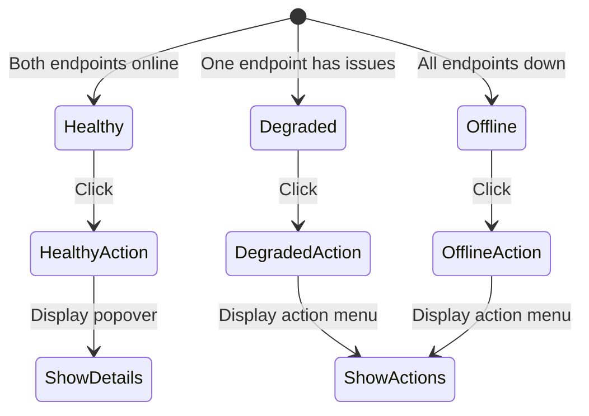

# Ollama Status Badge → Interactive Button

## Overview

Transform the Ollama status badge from a passive status indicator into an interactive button that allows users to take action when endpoints are offline or degraded.

## Current State

- **Component:** [`components/dashboard/ollama-status-badge.tsx`](components/dashboard/ollama-status-badge.tsx)
- **APIs:**
  - [`/api/ai/health`](app/api/ai/health/route.ts) - Dual-endpoint health check
  - [`/api/ollama-status`](app/api/ollama-status/route.ts) - Legacy single-endpoint
- **Cross-monitor:** [`lib/ai/cross-monitor.ts`](lib/ai/cross-monitor.ts) - Has existing recovery logic

## Proposed Changes

### 1. Badge Button States & Actions



### 2. Action Menu by State

| State             | Visual                 | Click Action         | Menu Items                                          |
| ----------------- | ---------------------- | -------------------- | --------------------------------------------------- |
| **All Healthy**   | Green badge with pulse | Open details popover | View latency, model info, refresh                   |
| **Degraded**      | Amber badge with pulse | Open action menu     | Ping endpoint, Load model, View details             |
| **Offline**       | Red badge, no pulse    | Open action menu     | **Ping/Wake endpoint**, Retry connection, View logs |
| **Loading Model** | Blue badge with pulse  | Open details popover | Show loading progress, Cancel                       |

### 3. New API Endpoint: `/api/ai/wake`

Create a new API route to handle wake/ping actions:

```ts
// POST /api/ai/wake
// Request body: { endpoint: 'pc' | 'pi' | 'all' }
// Response: { success: boolean, message: string, results: EndpointResult[] }
```

**Actions:**

- **Ping:** Force immediate health check with extended timeout
- **PC Wake:** Attempt to start Ollama service via `Start-Service Ollama` (Windows) or `systemctl start ollama` (Linux)
- **Pi Wake:** SSH to Pi and run `systemctl restart ollama` (if SSH configured)
- **Model Load:** Trigger model preload via `/api/generate` with empty prompt

### 4. Component Changes

#### Badge Wrapper

- Wrap existing badge content in a `<button>` element
- Add `cursor-pointer` and hover states
- Add `aria-label` for accessibility
- Add loading spinner during actions

#### Popover/Menu Component

- Create a small popover that appears on click
- Show relevant actions based on current state
- Display action result feedback (success/error)

#### Action Handlers

- `handlePing()` - Force immediate health check
- `handleWake(endpoint)` - Call `/api/ai/wake` for specific endpoint
- `handleLoadModel(endpoint)` - Trigger model preload
- `handleRefresh()` - Force badge refresh

### 5. Implementation Files

| File                                           | Change Type        | Description                                  |
| ---------------------------------------------- | ------------------ | -------------------------------------------- |
| `components/dashboard/ollama-status-badge.tsx` | Modify             | Add button wrapper, popover, action handlers |
| `app/api/ai/wake/route.ts`                     | **New**            | API endpoint for wake/ping actions           |
| `lib/ai/ollama-wake.ts`                        | **New**            | Wake logic for PC and Pi endpoints           |
| `components/ui/action-popover.tsx`             | **New** (optional) | Reusable popover component                   |

### 6. Detailed Implementation Steps

#### Step 1: Create Wake API Endpoint

```
app/api/ai/wake/route.ts
```

- Accept POST with `{ endpoint: 'pc' | 'pi' | 'all' }`
- For PC: Execute system command to start Ollama service
- For Pi: SSH command (if configured) or just extended ping
- Return results with success/failure status

#### Step 2: Create Wake Utility Module

```
lib/ai/ollama-wake.ts
```

- `pingEndpoint(url, extendedTimeout)` - Deep health check
- `wakePcOllama()` - Start PC Ollama service
- `wakePiOllama()` - SSH to Pi to restart (if configured)
- `preloadModel(url, model)` - Load model into memory

#### Step 3: Update Badge Component

- Add `useState` for popover open state
- Add `useState` for action loading state
- Wrap badge in `<button>` with onClick handler
- Create popover component with contextual actions
- Add action handlers that call the wake API
- Show loading spinner during actions
- Display success/error feedback

#### Step 4: Add Visual Feedback

- Hover state: slight brightness change
- Active state: pressed appearance
- Loading state: spinner overlay
- Success: brief green flash
- Error: brief red flash with error message

### 7. Security Considerations

- Wake API should be admin-only (already badge is admin-only in nav)
- Rate limit wake attempts (prevent spam)
- Log all wake attempts for audit
- PC service start requires appropriate permissions
- Pi SSH requires pre-configured keys

### 8. Fallback Behavior

- If wake fails, show helpful error message
- If SSH not configured for Pi, show manual instructions
- If permission denied, show admin contact suggestion
- If endpoint partially responds, show partial status

## Questions for User

1. **Pi Wake Method:** Is SSH already configured for Pi access, or should we just do extended ping/retry?
2. **Permission Level:** Should wake actions be admin-only or available to all chefs?
3. **Popover Style:** Dropdown menu or hovercard-style popover?
4. **Additional Actions:** Any other actions you want in the menu?
